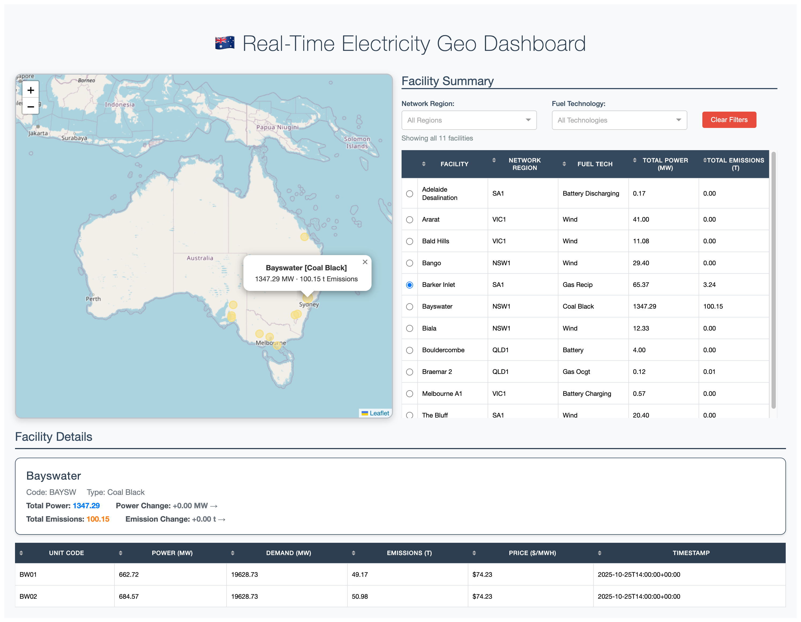

# Real-Time Electricity Geo Dashboard

## Installation

```bash
pip install -r requirements.txt
```

## Data Subscription and Visualisation

Map Visualisation

```bash
# Subscribe
python3 app.py
```

Test for Data Publish

```bash
# Publish test
python3 test_mqtt.py
```

## Features
- Live electricity data visualization
- Interactive map interface
- Real-time updates

## Screenshot


